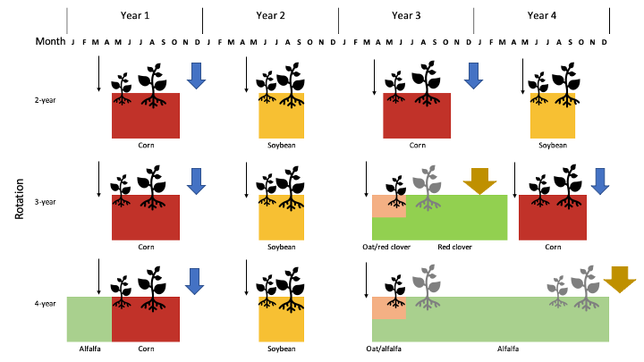

---
output:
    bookdown::word_document2:
      toc: false
      fig_caption: yes
    reference_docx: style_template.docx
bibliography: prospective-pop-dynamics.bib
---


```{r, include=FALSE}
library(readr)
library(flextable)
```


### Experiment design {-}
The general experiment design and diagram were provided in [@nguyenImpactCroppingSystem2022], but an updated diagram is provided below to include tillage regimes. Contrasting herbicide regimes have been used for both corn and soybean at the experiment site from 2008 and soybean plots were managed by conventional herbicide starting in 2017, but the data was collected .


```{r diagram, echo=FALSE, fig.cap= "Conceptual diagram of the three rotation systems compared within the experiment. A cycle of four calendar years is shown. Tillage regimes were symbolized with arrows: light, black ahead of crop sowing for field cultivator, medium, blue and bold orange after crop harvest for chisel and moldboard plough, respectively. Crops are color-coded and displayed for the approximate months that they were present. Emergence and establishment of common waterhemp plants are illustrated with black symbols. Grey plants shown in oat or alfalfa’s first year were physically controlled by crop harvest operations. Grey plants shown in alfalfa’s second year were physically suppressed three to four times by haynharvest. Alfalfa's hay was harvested when approximately 5% of the plants flowered."}


```
  

*Population transition matrices were calculated using Wood's quadratic programming method [Section 6.2, @caswellMatrixPopulationModels2001].*

The waterhemp population is considered size-structured with overlapping cohorts.
Cohorts in this experiment reflected the time stamps when the waterhemp sub-populations were surveyed.
Two consecutive surveys were approximately two to three weeks apart, as the weather permitted.

### Matrix form {-}   


*The periodic matrices are sub-divisions of an annual projection matrix: each is constructed based on critical points in a weed species' life cycle, which will provide a means to track when and where major changes in population dynamics happen.*
Details on periodic matrices construction and justification are provided in the next section.  

Each transition matrix of eight rows by eight columns (8 x 8) consists of four blocks using the format of matrix 4.8 in [Chapter 4, @caswellMatrixPopulationModels2001]. 
Each rotational transition matrix, $A_r$, is the product of two, three or four annual projection matrices, $P_c$ (c = 2, 3, or 4, corresponding to the number of crop phases in each rotation). Each annual projection matrices, corresponding to a crop environment, $P_c$, is the product of six sub-annual matrices, $B_k$ with $k = {1,2,...,6}$.s 

The general form of any matrix (periodic sub-annual ($B_k$), annual ($A_r$), or rotational ($P_c$)) is 

$$
\left[\begin{array}{c|c}
  M_{s} & M_{p\,\,to\,\,s}  \\ \hline
  M_{s\,\,to\,\,p} & M_{p} 
\end{array} \right]
$$

where,  
$M_s$, 2 x 2, is the transition within the seedbank population,   
$M_p$, 6 x 6, is the transition within the plant population,  
$M_{s\,\,to\,\,p}$, 6 x 2, is the transition from the seedbank to the plant population (emergence), and    
$M_{p\,\,to\,\,s}$, 2 x 6, is the transition from the plant to the seedbank population (distribution of newly produced seeds to the soil seedbank)   

Within a year, waterhemp population projection from time $k$ to $k+1$ was reflected by the changes in number of seeds and plants and calculated as follow [Chapters 2, 3 and 4, @caswellMatrixPopulationModels2001].  
$$N_{k+1} = B_k*N_k$$  
where,  
$\mathcal{B_k}$ is the square transition matrix from time $k$ to time $k+1$, and   
$N$ is the population vector (in column matrix form) of eight rows and one column.  
Waterhemp population transition in one crop phase, from pre-planting tillage to winter dormancy is calculated with 

$$ N_{r_{c,k+1}} = N_{r_{c,h}}*\prod_{k=1}^6 B_k  \;\;\;\;\;  [1]$$   
where,   
$r_{c}$ is the index for the $c^{th}$ crop phase in a particular rotation,   
$N_{r_{c}}$ is the Leslie's population matrix in crop phase $c^{th}$, and   [@leslieUseMatricesCertain1945]   
$B_k$ is the population transition matrix during summer    

The main factors that contribute to the success of the control practices are tillage regime, chemical herbicide, cultivation practice and crops' competitiveness. 
Among those four factors, crop competitiveness will not be factorized because this factor is dependent on other factors.  

The following parameters were collected and plugged into a general population model to examine when and where large changes in population dynamics might occur. 
The list of parameters and the corresponding formula is presented in Table 4.1 below.    

Table 4.1 - Model parameters  

| Parameter | Formula | Notation | Definition |  Reference | 
| --------- | ------------------------- | ------------------- | ----------------------------- | -------------- |   
| Common indexes | | $i=\{1,2,...6\}$ | Cohort number, 1 to 6 |   
| | | $d=\{1,2\}$ | Top (1) and bottom (2) soil strata |  
| | | $k$ | The time between two consecutive measurements |  
| | | $c$ | Crop: corn, soybean, oat, alfalfa |   
| | | $r$ | Rotation: 2-,3-,4-year |   
| | | $h$ | Corn weed management: low or conventional |  
| | | $N_{s_d}$ | Seedbank density at stratum $d^{th}$ |  
| | | $N_{p_i}$ | Cohort $i^{th}$ plant density |  
| --------- | ------------------------- | ------------------- | ----------------------------- | -------------- |   
| Seedling establishment | $$ e_{i,(r,c,h)} = \frac{N_{p_i,(r,c,h)}} {N_{s,(r,c,h)}}$$ |  | The proportion of the seedbank's top stratum to germinate to cohort $i^{th}$ |   
| Surface seedbank density | | $N_{s_1,(r,c,h)}$ | in Crop $c$, rotation $r$, herbicide $h$ |  
| Seedling density | | $N_{p_i,(r,c,h)}(k)$ | in Crop $c$, rotation $r$, herbicide $h$ |  
| --------- | ------------------------- | ------------------- | ----------------------------- | -------------- |      
| Plant survival | $$ l_{i,(r,c,h)} = \frac{N_{p_i,(r,c,h)}(k+1)} {N_{p_i,(r,c,h)}(k)}$$ |  | The proportion seedling in each cohort that survives until the end of the crop season |    
| Mature plant density | | $N_{p_i,(r,c,h)}(k+1)$ | in Crop $c$, rotation $r$, herbicide $h$ | 
| --------- | ------------------------- | ------------------- | ----------------------------- | -------------- |   
| | | $\phi$ | fecundity of a surviving plant (presumably resistant) relative to a susceptible one | 


### Model assumptions  

    

```{r assumptions, echo=FALSE}
#https://ardata-fr.github.io/flextable-book/captions-and-cross-references.html

assumptions <- read.csv("assumption-table.csv")

assumptions_ft <-flextable(assumptions)

assumptions_ft <- set_caption(assumptions_ft,
                              "Female-only population dynamics model assumptions for common waterhemp (*Amaranthus tuberculatus*)")

assumptions_ft 
```

### Parameterization {-}
The empirical data was organized by corn weed management regimes, i.e., conventional (conv) versus low herbicide, because the herbicide regime change was recent while the legacy effect of weed control program on each subplot may last for a few years [@rasmussenLegacyPesticidePollution2015; @gibsonBenchmarkStudyGlyphosateresistant2016]. *Details on the empirical and literature data collection and justification are listed below.* 

From spring to winter, the sequences of sub-annual matrices are: pre-planting tillage, emergence, summer survival, fecundity, post-harvest tillage, and overwinter survival. Each sub-annual period is an 8x8 matrix consists of four blocks using the format of matrix 4.8 in [Chapter 4, @caswellMatrixPopulationModels2001]. 

```{r parameterization, include=FALSE}
#https://ardata-fr.github.io/flextable-book/captions-and-cross-references.html

parameters <- read.csv("demographic-parameters.csv")

parameters_ft <-flextable(parameters)

parameters_ft <- set_caption(parameters_ft,
                              "Female-only population dynamics model parameters for common waterhemp (*Amaranthus tuberculatus*)")

parameters_ft 
```

#### Vertical redistribution of seeds, in pre-planting and post-harvest tillage {-}

In fall 2019, 36 soil cores were collected for seedbank densities estimation at two soil strata, 0-2cm as the top (1), and 2-20 cm depth as the bottom (2). 


The redistribution of female seeds that were produced at the end of the crop season is calculated per each crop phase under each rotation using the transition matrices corresponding to each tillage regime by @spokasSeedChaserVerticalSoil2007. No-till is represented by an identical matrix after  @cousensModelEffectsCultivation1990.    

#### Seedling recruitment {-}
Seedling recruitment was calculated as the proportion of emerged seedlings with regards to the top 0-2 cm top soil stratum: $N_{Apr\,through\,Oct\,2020}/N_{Nov\,2019}$, where $N_{in\,season\,2020}$ 

#### In-season survival {-}

#### Plant fecundity {-}

#### Overwinter survival {-} 
what assumptions, list in previous table

### Population growth rate and its variance {-}  

The variance of population growth rate is calculated with $Var(\lambda)= \sum_i^b S_b^TV_bS_b$ where $V$ is the variance-covariance matrix of each periodic matrix.   

Variance of annualized population growth rate is calculated with Taylor series expansion using the general formula: $Var[f(\lambda)] = {f'(E(\lambda))}^2 Var(\lambda)$, in which $f(\lambda)$ is the nth-root function used to annualize the rotation-wise growth rates. For example, the variance of annualized population growth rate in the 2-year rotation was $Var(\lambda_{2}) = \frac{1}{4\lambda_{2r}}Var(\lambda_{2r})$, where $\lambda_2 = \sqrt{\lambda_{2r}}$.  

 In all LTRE procedures presented here, the conventional corn weed management treatment is the reference treatment and low herbicide the treatment of interest. Following @caswellSensitivityAnalysisPeriodic1994's notions:

The sensitivity of $\lambda$ to each element of each sub-annual periodic matrix is calculated with

$$
S_{B(h)} = {(B_{(h-1)}...B_{(1)}...B_{(h+1)})}^TS_{A(h)} = D^T S_{A(h)} \,\,\,(1)
$$ where,\
$B_{(h)}$ is the periodic projection matrix for sub-annual period h; h = {1,...,6},\
$D^T$ is the transpose of the matrix product of all the $B_{(h)}$, and\
$S_{A(h)}$ is the sensitivity of $\lambda$ to each element of $A^*_{(h)}$ (the average annual projection matrix between the reference treatment and the treatment of interest)

The elasticities of $\lambda$ to each element of a sub-annual projection matrix is calculated with\
$$
E_{B(h)} = \frac{b_{ijk}}{\lambda} S_{B(h)} \,\,\,(2)
$$ where,

$b_{ijk}$ is the entry at row i column j of matrix $B_{(h)}$, and other elements as defined in Equation (1).

### Elasticity of population growth rate on each lower-level parameter {-}

Matrix calculation in this study was performed in R version 4.2.0 [@rdevelopmentcoreteamLanguageEnvironmentStatistical2022]. The population growth rate, $\lambda$, sensitivity and elasticity were calculated with `eigen.analysis` function [@stubbenPopbioConstructionAnalyse2020].