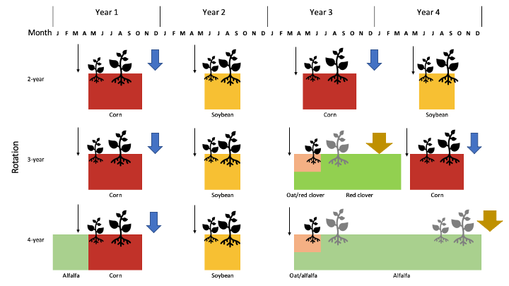

---
output:
    bookdown::word_document2:
      toc: false
      fig_caption: yes
#    reference_docx: style_template.docx
bibliography: WH-pop-dynamics.bib
---


```{r, include=FALSE}
library(readr)
library(flextable)
library(tidyverse)
```


### Experiment design {-}  

To study how common waterhemp’s demography differs in three cropping systems suitable for the Midwestern USA, we used a factorial experiment design with nine crop identities crossed with two weed management regimes. Crop identity was assigned to main plots and comprised the combination of crop species name and rotation system. The different weed management regimes were assigned to split plots and comprised conventional versus low herbicide regimes applied to the corn phase of each of three rotation systems The rotation systems used in this study included a 2-year (corn-soybean) rotation, a 3-year (corn - soybean - oat (*Avena sativa* L.)) intercropped with red clover (*Trifolium pratense* L.) rotation, and a 4-year (corn - soybean - oat intercropped with alfalfa (*Medicago sativa* L.) - alfalfa] rotation. There were four replications of each crop identity x herbicide regime combination. Field plots were located at the Iowa State University Agricultural Engineering and Agronomy Research Farm in Boone County, Iowa, USA.

The general experiment design and diagram were provided by @nguyenImpactCroppingSystem2022, but an updated diagram (Figure \@ref(fig:diagram)) includes tillage regimes used for each treatment. Contrasting herbicide regimes were used for corn at the experiment site from 2008 through 2020; soybean plots in the contrasting weed management regimes were treated with different herbicides during 2008-2016, but with the same herbicide regime in 2017-2020. During the period of the present study, data were collected in each experimental unit (eu) to accommodate the different weed management programs used in the corn phase of all crop rotations.  


```{r diagram, echo=FALSE, fig.cap = "Conceptual diagram of the three rotation systems compared within the experiment. A cycle of four calendar years is shown. Tillage regimes are symbolized with arrows: light, black ahead of crop sowing for field cultivator and medium, blue and bold orange after crop harvest for chisel and moldboard plowing, respectively. Crops are color-coded and displayed for the approximate months that they were present in the field. Emergence and establishment of common waterhemp plants are illustrated with black symbols. Grey plants shown in oat or alfalfa’s first year were physically controlled by crop harvest operations. Grey plants shown in alfalfa’s second year were physically suppressed three to four times by hay harvest. Alfalfa hay was harvested when approximately 5% of the plants flowered. Red clover in the O3 treatment and alfalfa in the A4 treatment were terminated in the winter before growing corn in the following year, so the dark green bar in the 3-year rotation represents volunteer red clover and the light green bar in the 4-year rotation represents the living alfalfa residue in the C4 treatment."}


```


### Data collection and analysis {-}

The current demographic information presented here is only for female waterhemp seeds and plants because: 1) waterhemp is a dioecious species with 1:1 sex ratio [@costeaBiologyInvasiveAlien2005; @montgomerySexspecificMarkersWaterhemp2019; @montgomeryMaleSpecificChromosomal2021], 2) only female individuals are bearing seeds [@costeaBiologyInvasiveAlien2005], and 3) pollen grains are abundantly available during reproduction [@liuPollenBiologyDispersal2012]. All plant characteristics were reported for each cohort and seedbank densities were reported for two soil strata: 0 - 2 cm and 2 - 20 cm.    

#### Seed densities and seed fates in the soil seedbank {-}  

Nine groups of four 20-cm deep soil cores arranged in a 3 x 3 grid were collected in the fall of 2019 from each experimental unit (eu). Each soil core was cut into two sections, the top 2 cm and the bottom 18 cm. No deeper sampling was conducted because the tillage regimes applied at the experiment affected the top 0 - 20 cm of the soil. All the 0-2 cm sections in each (eu) were packed separately from all the 2-20 cm sections, so each eu yielded two data points, one for each of the two soil strata. Seeds were separated from the soil materials and plant residues using elutriation and flotation [@ballComparisonTechniquesEstimation]. Clean seeds were placed on germination paper imbibed with distilled water in Petri dishes and incubated in 28/18 degree Celsius light/dark - 18/8 hour night/day for five days. Proportions of seeds that were dormant, readily germinable, and dead were recorded: germinated as readily germinable; firm and unyielding to forceps pressure as dormant; and yielding to forceps pressure as dead (Borza et al., 2007). Readily germinable and dormant seeds were grouped as viable and used to calculate emergence proportion (details on how the 2019 fall soil seedbank sample was used with data for 2020 seedling emergence to determine the emergence proportion is provided in the *Parameterization* section).

#### Seedling emergence pattern and timing {-}
 
In the 2019 field season, non-destructive emergence surveys were conducted once every two to three weeks (weather permitting) in eight quadrats per eu. Seedlings were marked with color-coded toothpicks for cohort identification. Within an eu, seedlings that were in the same cohort were marked with the same toothpick color. Six cohorts of plants were followed from seedling to senescence. 

In the 2020 field season, destructive emergence surveys were conducted in eight quadrats per eu. Seedlings were clipped at the base of the plant without disturbing the soil. With the intention of evaluating the proportion of seed germinated from the top 2 cm layer of the soil, eight to ten cohorts (depending on the crop environments) were recorded. 

The number of seedlings in each cohort was converted to densities (seedlings/m$^2$). The dates of first emergence detection in a crop identity were noted as the date that cohort 1 emerged in that crop identity. The estimated seedling emergence rates ($\frac{Seedling \, density}{Top \, soil \, stratum \, density}$) were unrealistically low as compared to the results of @schutteCommonWaterhempAmaranthus2014 and @buhlerEmergencePersistenceSeed2001 so we adjusted the estimation to reflect higher emergence rate based on 20% germination rate (Appendix B). We used 20% emergence rate following @schutteCommonWaterhempAmaranthus2014's results because their investigation comprised of 129 waterhemp populations.  

#### Statistical analysis of the measured parameters {-}

All the response variables were analyzed with two-factorial mixed-effect models, in which crop identity (crop species in each rotation) was the main-plot effect, corn weed management was the split-plot effect, and cohort identity was the covariance. The response variables were transformed as needed to correct heteroscedasticity.  

For the emergence timing evaluation, a two-factorial model with crop species, instead of crop identity, being the main-plot factor  and the corn weed management being the split-plot factor was fitted on the Julian's date of first emergence because of small sample size. We feel that a slight modification of statistical structure was acceptable because we were interested in the difference in waterhemp emergence in different crop species environments.

### Model assumptions {-}   
 
The assumptions used in the modeling exercise in this manuscript are listed in Table \@ref(tab:assumptions).   

```{r assumptions, echo=FALSE}
#https://ardata-fr.github.io/flextable-book/captions-and-cross-references.html

Stage = c("All", " ", "Seed", rep(" ", 8), " Young plant", rep(" ", 4), "Mature plant", rep(" ", 2))

Assumption = c("sex is stable throughout the life cycle",
               "equal growth rate across individuals of the same size and shape under the same treatments (crop  x rotation x herbicide",
               "euqal germination probability across sexes",
               "the sex ratio is 1:1",
               "sex is determined at seed formation",
               "seedlings only emerge from the 0 - 2 cm",
               "germination is most likely fatal from the 2 - 20 cm soil stratum",
               "equal decay rate across sexes",
               "different decay rate across all burial depths",
               "equal palatability to granivores across sexes",
               "granivore activities are an important threat",
               "female plants are more likely to survive under stressful conditions than male plants",
               "competition with crops for resources was expressed in multiple periods",
               "competition with other weed species is excluded",
               "intraspecific competition is included in the survival rate from seedling through maturity",
               "the weed control program catered to the specific crop is the main cause of mortality",
               "pollen is abundantly available to all female plants at reproductive stage",
               "50% of the seeds produced by each female plant are female",
               "male:female ratio can deviate from the 1:1 ratio under different conditions")

`References or justification` <- c("Montgomery et al., 2019 and 2021",
                                  "Chapter 8, Caswell, 2001",
                                  "No evidence of sexually differentiated seed germination probability",
                                  "Costea et al., 2005",
                                  "Montgomery et al., 2019 and 2021",
                                  "Mohler and Galford, 2008",
                                  "Davis and Renner, 2007",
                                  "No evidence of sexually differentiated seed decay rate",
                                  "Buhler et al., 2001, Steckel et al., 2007 and Sosnoskie et al., 2013",
                                  "No evidence of sexually differentiated palatability",
                                  "van der Laat et al., 2015",
                                  "deduced collectively from the general 1:1 sex ratio (Costea et al. 2005) and differentiated sex ratio at maturity across weed management systems at the experiment site in 2018 (Nguyen and Liebman 2022b)",
                                  "specific mortality or size reduction caused by crops was not measured",
                                  "excluded for simplicity of the model",
                                  "specific mortality or size reduction caused by other weed species was not measured",
                                  "Ryan et al., 2010",
                                  "pollen grains can remain viable for five days after dispersal (Liu et al., 2012) and the populations at the expriment site were close to sexual parity with abundant plant densities (Nguyen and Liebman, 2022b)",
                                  "Costea et al., 2005",
                                  "Nguyen and Liebman 2022b and Montgomery et al., 2019 and 2021")


assumptions <- data.frame(Stage, Assumption, `References or justification`)

assumptions %>%
  flextable() %>% 
  set_caption("Female-only population dynamics model assumptions for common waterhemp (*Amaranthus tuberculatus*)") %>%
  width(width = c(2, 3, 3.5))  %>% autofit()
```

### Matrix form {-}   

Each rotation transition matrix, $A_r$, is the product of two, three or four annual projection matrices, $P_rw$ (r = 2, 3, or 4, corresponding to the number of crop phases in each rotation and w = conventional (conv) or low, corresponding to the weed management regime applied in the corn phase). Each set of annual projection matrices, corresponding to a crop environment, $P_r$, is the product of six sub-annual matrices, $B_h$ with $h = \{t(s), g, s, f, t(f), o\}$. The six sub-annual matrices, in chronological order from spring to winter, are pre-planting tillage induced seed vertical movement ($B_{t(s)}$), emergence ($B_g$), summer seed and seedling survival ($B_s$), fecundity ($B_f$), post-harvest tillage induced seed vertical movement ($B_{t(f)}$), and overwinter seed survival ($B_o$). 

Any transition matrix (periodic sub-annual, ($B_h$), annual, ($A_r$), or rotational, ($P_r$)), is of eight rows by eight columns (8 x 8) and consists of four blocks using the format of matrix 4.8 in [Chapter 4, @caswellMatrixPopulationModels2001].  

$$
\left[\begin{array}{c|c}
  M_{s} & M_{p,s}  \\ \hline
  M_{s,p} & M_{p} 
\end{array} \right]
$$

where,  
$M_s$, 2 x 2, is the transition within the seedbank population (tillage-induced seed movement and summer and overwinter seed survival),   
$M_p$, 6 x 6, is the transition within the plant population (seedling survival to maturity),  
$M_{s,p}$, 6 x 2, is the transition from the seedbank to the plant population (emergence), and    
$M_{p,s}$, 2 x 6, is the transition from the plant to the seedbank population (distribution of newly produced seeds to the soil seedbank)  

The compilation of each $B_h$ matrix, from the published literature, empirical measurement, or both sources of parameters are detailed in the *Parameterization* section. In total, eighteen sets of six sub-annual periodic matrices were used. Each set of sub-annual matrices was constructed for every crop identity crossed with corn weed management combination. Population transition matrices were calculated using Wood's quadratic programming method [Section 6.2, @caswellMatrixPopulationModels2001].
  

### Parameterization {-}   
Waterhemp plant size is highly variable, and thus, the individual plant fecundity is highly variable. For example, the dried weight of the smallest recorded waterhemp at our experiment did not register on a four-digit scientific scale whereas the dried weight of the largest plant was about 1 kilogram (data not shown). The control efficacy of the applied weed management programs on waterhemp is therefore more informatively reflected by fecundity (seeds/plant) or seed production (seeds/m$^2$) than plant density.  

To accommodate the elasticity of plant size, two scenarios of population dynamics presented in this manuscript were distinguished by plant fecundity to examine the impact of different control efficacy on population dynamics (see *Plant fecundity* for details). In scenario 1, plant cohorts were recorded. In scenario 2, plant cohorts were assigned by their size because the emergence timing of the sampled plants were not included under the assumption that plant size decreases as emergence is delayed (Table \@ref(tab:assumptions)). All the parameters were calculated for a female-only population because only female plants bear seeds. Consequently, the modeled population size reflected half of the population size in reality. The seedbank densities of the whole population (male and female) from 2014 through 2019 were shown in Figure \@ref(fig:seedbank-14-19-box).  

**For consistency and because most seedlings emerged in the first six cohorts ($\leq 97%$ Table \@ref(tab:emerge-2020-first-six-prop)), only the first six cohorts were included in the model.**


The lower-level demographic parameters are demographic parameters at each sub-annual period, $B_h$, filling $B_h$ elements at positions that describe seed and plant dynamics. From left to right, the eight columns of a $B_h$ matrix are named as `s_t`, `s_b`, `pt_co_1`, ..., `p_co_6`. The columns `s_t` and `s_b` represent two stratum of the soil seedbank: the top 0-2 cm and the bottom 2-20 cm. The columns `p_co_1` through `p_co_6` represent the plant cohorts 1 though 6. The same order is applied down eight rows of $B_h$.  

The examined lower-level demographic parameters can be grouped based on their impacts on preserving and producing new seeds, hereafter referred to as seed production, seed preservation, and neutral parameters. The seed preserving parameters are the probability of seeds not emerging ($d = 1 - \sum_{k=1}^6 g_k$). The seed producing parameters are the emergence probabilities ($g_k, k = \{1,...6\}$), the survival rates of seeds ($s_{sk}, k = \{1,2\}$) and seedlings ($s_{pk}, k = \{1,...,6\}$) during summer, the fecundity rate ($f_k,  k = \{1,...,6\}$), and the survival rate overwinter ($o_k, k = {1,2}$). Even though emergence reduces the seedbank, the number of seeds that are produced from an emerged seedling that succeeds until seed production are substantial, so emergence is considered positively impacting new seed production [@davisWeedSeedPools2008]. The neutral parameters for both seed preservation and seed production are tillage-induced seed movement across soil strata at the pre-planting ($t_{ij,s}, i,j = \{1,2\}$) and post-harvest $t_{ij,f}, i,j = \{1,2\}$) periods. The tillage-induced seed vertical movement rates are considered neutral parameters because the seeds that are kept at or moved to the 0-2 cm soil layer can be exposed to emergence stimulants or granivores while the seeds that are kept at or moved to the 2-20 cm soil layer can germinate without reaching the soil surface (fatal germination), are exposed to decaying stimuli; or preserved at optimal conditions [@burnsideSeedLongevity411996; @davisEnvironmentalFactorsAffecting2005; @davisInfluenceSeedDepth2007]. 


Details of how each of the matrices were form are in the Appendix, but a summary of the range of each parameter is provide below.  

```{r parameterization, echo=FALSE}
#https://ardata-fr.github.io/flextable-book/captions-and-cross-references.html
## Scenario 2
Parameter <- c("Top seeds stay at top stratum",
                "Top seeds move to the bottom",
                "Bottom seeds move to the top stratum",
               "Bottom seeds stay at bottom stratum",
                "Emergence rate",
                "Plant survival rate",
                "Seed survival rate",
                "Plant fecundity")
Denomination <- c("t_11,s or t_11,f",
                  "t_12,s or t_12,f",
                  "t_21,s or t_21,f",
                  "t_22,s or t_22,f",
                  "e_1 through e_6",
                  "s_1,p through s_6,p",
                  "s_11,s, s_22,s, o_11,s o_22,s",
                  "f_1 through f_6")

Unit <- c(rep("seeds/seeds",4),
          "plants/seeds",
          "plants/plants",
          "seeds/seeds",
          "seeds/plant")

Corn <- c("pre-planting: 0.59; post-harvest: 0.59", "pre-planting: 0.15; post-harvest: 0.1", "pre-planting: 0.41; post-harvest: 0.41", "pre-planting: 0.85; post-harvest: 0.9",
          "1.7 x 10^-6 - 0.07", 
          "0.01 - 0.84",
          "summer: 0.66 - 0.74; overwinter: 0.66 - 0.74",
          "Scenario 1: 1.0 - 3518.6; scenario 2: 4.3 - 9003620")

Soybean <- c("pre-planting: 0.59; post-harvest: 1", "pre-planting: 0.15; post-harvest: 0", "pre-planting: 0.41; post-harvest: 0", "pre-planting: 0.85; post-harvest: 1",
             "1.8 x 10^-6 - 0.02", 
             "0 - 0.89",
             "summer: 0.66 - 0.74; overwinter: 0.66 - 0.74",
             "scenario 1: 0 - 35.5; scenario 2: 0.5 - 4453381.0")

Oat <- c("pre-planting: 0.59; post-harvest: 0.02 - 1", "pre-planting: 0.15; post-harvest: 0 - 0.07", "pre-planting: 0.41; post-harvest: 0 - 0.98", "pre-planting: 0.85; post-harvest: 0.93 - 1",
         "3.3 x 10^-6 - 0.0006", 
         "0.1 - 0.9",
         "summer: 0.66 - 0.74; overwinter: 0.66 - 0.74",
         "scenario 1: 3.9 - 964.0; scenario 2: 3.9 - 4115522.0")

Alfalfa <- c("pre-planting: 1; post-harvest: 0.02", "pre-planting: 0; post-harvest: 0.07", "pre-planting: 0; post-harvest: 0.98", "pre-planting: 1; post-harvest: 0.93", 
             "0.0008 - 0.1",
             "0.1 - 0.5", 
             "summer: 0.66 - 0.74; overwinter: 0.66 - 0.74",
             "scenario 1: 0.64 - 11.8; scenario 2: 0.2 - 14478.1")

parameterization <- data.frame(Parameter,Denomination, Unit, 
                               Corn, Soybean, Oat, Alfalfa)

parameterization %>%
  flextable() %>% 
  set_caption("Female-only population dynamics model parameters for common waterhemp (*Amaranthus tuberculatus*)") %>%
#  width(width = c(2, 3, 3.5))  %>% 
  autofit()
```

### Modeling {-}
 
Within a year, waterhemp population projection from sub-annual period $h$ to $h+1$ was reflected by the changes in number of seeds and plants and calculated as follow [Chapters 2, 3 and 4, @caswellMatrixPopulationModels2001].  
$$N_{h+1} = B_h*N_h$$  
where,  
$B_h$ is the square transition matrix from time $h$ to time $h+1$, and   
$N$ is the population vector (in column matrix form) of eight rows and one column.  
Waterhemp population transition in one crop phase, from pre-planting tillage to winter seed dormancy is calculated with 

$$ N_{r_{c,h+1}} = N_{r_{c,w}}*\prod_{h=1}^H B_h  \;\;\;\;\;  [1]$$   
where,   
$r_{c}$ is the index for the $c^{th}$ crop phase in a particular rotation,   
$N_{r_{c}}$ is the Leslie population matrix  [@leslieUseMatricesCertain1945] in crop phase $c^{th}$ corn weed management $w^{th}$, and     
$B_h$ is the population transition matrix during summer    

The main factors that contribute to the success of the control practices used for waterhemp are tillage regime, herbicides, cultivation practice, and crops' competitiveness. Among those four factors, crop competitiveness is reflected in waterhemp emergence proportion, mature plant size (intermediate value to calculate fecundity), and fecundity because this factor could not be measured independently.  


Matrix calculation in this study was performed in R version 4.2.0 [@rdevelopmentcoreteamLanguageEnvironmentStatistical2022].  

#### Population growth rate {-}  
We projected population growth rates under two scenarios of control efficacy. The high-efficacy scenario (Scenario 1) and the low-efficacy scenario (Scenarios 2) used different fecundity values in the seed production sub-annual period but the same vital rates in all other sub-annual periods.   

The `eigen.analysis` function in the `popbio` package version 2.7 [@stubbenPopbioConstructionAnalyse2020] was applied on matrices $P_{2w}$, $P_{3w}$, and $P_{4w}$ to obtain the population growth rate ($\lambda$) in each rotation crossed with corn weed management regime during the full crop cycle.

The rotation-wise population growth rates ($\lambda_{rw}$, $r = \{2,3,4\}$) were extracted from the `$lambda` element in the comprehensive output of `eigen.analysis` for each of $A_2$, $A_3$, and $A_4$. The annualized population growth rates for each rotation crossed with corn weed management regime ($\lambda(2w)$, $\lambda(3w)$, and $\lambda(4w)$) were obtained from taking the square root, cubic root, and fourth root of $\lambda_{2w}$, $\lambda_{3w}$, and $\lambda_{4w}$.  

#### Sensitivity of population growth rate on each lower-level parameter {-}

In all the Life Table Retrospective Experiment (LTRE) procedures performed here, the conventional corn weed management treatment is the reference treatment and the low herbicide regime is the treatment of interest, following @caswellSensitivityAnalysisPeriodic1994's notions.

The sensitivities of rotation-wise $\lambda_{rw}$, $r = \{2,3,4\}$ to changes in sub-annual demographic parameters are not presented in this manuscript, but $S_{B_h}$ were used as intermediate parameters to calculate the elasticity of $\lambda$ to each element of a sub-annual projection matrix. The sensitivity of $\lambda$ to each element of each sub-annual periodic matrix is calculated with

$$
S_{B_h} = {(B_{(h-1)}...B_{(1)}...B_{(h+1)})}^TS_{A(h)} = D^T S_{A(h)} \,\,\,(2)
$$ 

where,
$B_h$ is the periodic projection matrix for sub-annual period h; $h = \{ts, e, s, f, tf, o\}$,
$D^T$ is the transpose of the matrix product of all the $B_h$, and
$S_{A(h)}$ is the sensitivity of $\lambda_{rw}$ to each element of $A^*_h$ (the average annual projection matrix between the reference treatment and the treatment of interest). $S_A(h)$ was calculated by applying the `sensitivity` function from the `popbio` package on the $A^*_h$.  

In general, each $S_{B_h}$, except for $S_{B_g}$ - sensitivity of  $\lambda_{rw}$ to summer survival, is a 8 x 2 matrix. In all $S_{B_h}$, only the first column was used in calculating the variance of population growth rate because the first column contains sensitivity values that concerns the population dynamics from changes in eight categories of interest, namely, seed density in the 0-2 cm soil stratum, seed density in the 2-20 cm soil stratum, and plant cohort one through six. The second through eighth columns are irrelevant under this manuscript's scope because those columns explain theoretical changes to $\lambda$ if other patterns occurred in the population dynamics, such as if seeds from the 2-20 cm emerged and contributed (column two), or if plant cohort one "becomes" cohort two (column three), and so on.  


#### Elasticity of population growth rate on each lower-level parameter {-}

The elasticity of  $\lambda_{rw}$ to each element of a sub-annual projection matrix is calculated with
$$
E_{B(h)} = \frac{b_{ijh}}{\lambda} S_{B(h)} \,\,\,(3)
$$ 

where,

$b_{ijh}$ is the entry at row i column j of matrix $B_h$, and other elements as defined in Equation (2).

#### Simulations {-}  

Since plant fecundity was the most influential on population growth and waterhemp was more prolific in the warm-season crop environments than the cool-season crop environments, we followed up with a simulation of either seed production threshold or mature plant density in corn and soybean. We used a theoretical plot of 1 m$^2$ with 10000 seeds in the top 0 - 2 cm soil stratum and 0 seed in the 2 - 20 cm soil stratum and followed that theoretical plot in three rotations (2-year, 3-year, and 4-year) crossed with two corn weed management regimes (conventional and low herbicide), as empirically experimented at our research site. We were interested in the following question: 

*How much weed control efficacy is necessary to keep a waterhemp population stable ($\lambda \approx 1$)? Control efficacy in waterhemp in this study is measured by seed production (seeds/m$^2$) instead of plant density because waterhemp plant size is highly variable.*

 
All the population dynamics, except for plant fecundity of cohort 1 through 3, were kept as in the prospective modeling exercise. We estimated the necessary control efficacy in the corn and soybean crop environments by simulating seed production allowance for plant cohorts 1 through 3. We only manipulated fecundity of cohorts 1 through 3 because 1) the first three cohorts are most likely exposed to herbicides or cultivation than the later cohorts, 2) the first three cohorts, especially cohorts 1 and 2, have higher survival rates than the later cohorts, and 3) in general, the earlier cohorts are more capable of accumulating larger aboveground mass, and thus, hold higher reproductive potentials than later cohorts,.   

In each seed production threshold simulation iteration, the seed production sub-annual matrix ($B_f$) was manipulated while all the other five sub-annual matrices were kept the same as in the population projection exercise. A randomized number of seeds was generated for each of cohorts 1 through 3 using function `rlnorm(1, m, s)`, in which m is the mean fecundity on natural logarithm scale and s is the standard deviation on the natural logarithm scale. m and s were obtained from the a general relationship of `ln(individual fecundity +1)` against `ln(individual aboveground mass + 0.005)` [@nguyenImpactCroppingSystem2022] that pooled all the 389 data points from the whole experiment. Twenty-four pairs of s and m were estimated (details are in Table \@ref(tab:24-bin) in the Appendix). Different pairs of s and m were tried in the simulation until annualized $\lambda \approx 1$ in each treatment.     

In each mature plant density threshold simulation iteration, the input survival rates of cohorts 1 through 3 in the summer survival subannual matrix ($B_s$) was reduced until annualized $\lambda \approx 1$ in each treatment. All the other five sub-annual matrices were kept the same as in the population projection exercise. The final manipulated survival rates were used with the unmanipulated survival rates to calculate the cohort-based mature plant density and population-wise plant density.         
